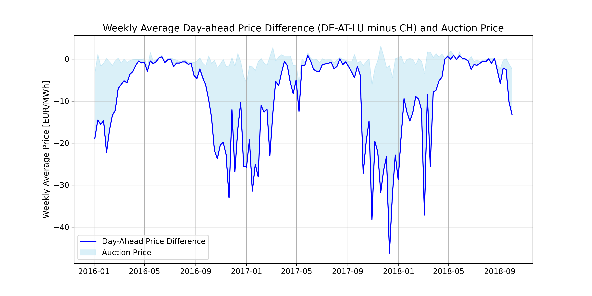

# Bridging the Gap: Analyzing Auction Prices and Day-Ahead Market Discrepancies at the Swiss-German Electricity Border

<a target="_blank" href="https://cookiecutter-data-science.drivendata.org/">
    
</a>

## Motivation

Day-ahead electricity markets allow electricity to be traded for delivery in single-hour blocks the following day. Germany-Luxembourg (prior 2018 also indlucing Austria) and Switzerland are separate markets, each with its own electricity price. Limited cross-border capacity is auctioned by the Joint Allocation Office (JAO) for electricity to flow between these markets. 

This project investigates whether the auction prices for this cross-border capacity align with price differences in the respective day-ahead markets. 

## Results Preview



**Description:**
- The plot displays the weekly average price difference between the Germany-Austria-Luxembourg (DE-AT-LU) and Swiss (CH) day-ahead electricity markets (blue line).
- The shaded area represents the auction price for cross-border transmission capacity from Switzerland to Germany.
- The analysis highlights periods where day-ahead market price differences do not align with auction prices, suggesting potential inefficiencies in cross-border electricity trading.

**How to approach this repository:**
- In `reports/`, `main.tex` is the full short paper containing the results, and `beamer.tex` contains the accompanying slides.
- To understand the structure of the data analysis, start with `walkthrough.ipynb`. This notebook provides an overview of the project and guides you through the core steps.
- In `notebooks/`, three detailed notebooks break down specific aspects of the analysis:
  - `1_process_data.ipynb`: Data cleaning and preprocessing.
  - `2_analysis.ipynb`: Intermediate analysis and feature engineering.
  - `3_results.ipynb`: Full results and final analysis.
- In `src/` are some helper functions for data processing or data analysis. 
---

## Setup Instructions

### Prerequisites

1. **Docker**: Ensure Docker is installed and running on your system.
2. **JAO API Authentication Key**: Obtain an API key for accessing JAO data (Link: https://www.jao.eu/faq/809787). 
3. **Entso-E Day-Ahead Prices**: Go to Entso-E Transparency Platform, create an account, and download the yearly day-ahead price data (in hourly granularity) for CH and DE. The datasets should have names of the form {country code}_Day-ahead Prices_{Year}.csv (e.g. CH_Day-ahead Prices_2016.csv). We put an example dataframe in the folder. To run the exact same analysis, you need the files
    - CH_Day-ahead Prices_2016.csv until CH_Day-ahead Prices_2013.csv
    - DE-AT-LU_Day_ahead Prices_2016 until DE-AT-LU_Day_ahead Prices_2018.csv
    - DE-LU_Day_ahead Prices_2018 until DE-LU_Day_ahead Prices_2023.csv
    These files need to be saved in data/raw!
---

### Obtain JAO API Key

1. Visit the [JAO API documentation](https://www.jao.eu/) to request an API key.
2. Store the API key securely and add it to `src/config.py` file:

```python
KEY = "your_api_key_here"
```

---
### Setup the Environment

#### Build the Docker Container
Run the following command to set up the Docker environment:

```bash
make build
```

#### `Dockerfile`

Specifies the container setup, including:
- Python 3.10
- LaTeX packages
- Installation of Python dependencies from `requirements.txt`.

#### `Makefile`

Defines the available commands:
- `make build`: Builds the Docker container.
- `make jupyter-browser`: Starts Jupyter Notebook and opens it in a browser.
- `make process`: Executes and updates Jupyter Notebooks.
- `make compile`: Compiles LaTeX files to generate PDFs.
- `make run-all`: Runs the full pipeline (build, process, compile). 

The commands `make process` and `make run-all` need 
1. Entso-E data in data/raw as discussed and
2. An API-key of JAO in src/config.py
to work!
---

### Commands Overview

| Command                | Description                                      |
|------------------------|--------------------------------------------------|
| `make build`           | Builds the Docker container.                     |
| `make jupyter-browser` | Starts Jupyter Notebook and opens it in a browser. |
| `make process`         | Executes and updates Jupyter Notebooks.          |
| `make compile`         | Compiles LaTeX files to generate PDFs.           |
| `make run-all`         | Runs the full pipeline (build, process, compile).|

---

## Project Structure

```
├── README.md                <- Project overview and setup instructions.
├── requirements.txt         <- Python dependencies.
├── Dockerfile               <- Defines the Docker environment for the project.
├── Makefile                 <- Automation commands for building, running, and managing the project.
├── walkthrough.ipynb        <- High-level project overview and guide through the data analysis.
├── docker-compose.yml       <- Docker Compose configuration for multi-container setups.
├── .gitignore               <- Specifies files and directories to ignore in version control.
├── data
│   ├── processed            <- Final cleaned data (output from `1_process_data.ipynb`).
│   ├── external             <- Holds JAO DataFrames created by `1_process_data.ipynb`.
│   └── raw                  <- Raw input data (e.g., from Entso-E, as described in Prerequisites).
├── notebooks
│   ├── 1_process_data.ipynb <- Jupyter notebook for cleaning and preparing input data.
│   ├── 2_methodology.ipynb  <- Jupyter notebook detailing the methodology and hypotheses.
│   └── 3_results.ipynb      <- Jupyter notebook performing the analysis and generating results.
├── reports
│   ├── main.tex             <- Full report with detailed documentation and results.
│   ├── beamer.tex           <- Slide deck summarizing the project content.
│   └── figures              <- Plots and figures generated in `3_results.ipynb`.
└── src
    ├── config.py            <- Configuration file. Add your JAO API key here as `KEY = '...'`.
    ├── utils.py             <- Utility functions for statistical analysis.
    └── datafeed
        ├── downstream.py    <- Functions to create final data structures.
        └── upstream.py      <- Functions to retrieve data from the JAO API.
```
---

## Notes

- **Mock Data:** For testing of `1_process_data.ipynb`, use mock data provided in the `data/raw` or in `data/external`. But for running the notebook `3_results.ipynb`, you need to follow the steps described in this file. 

